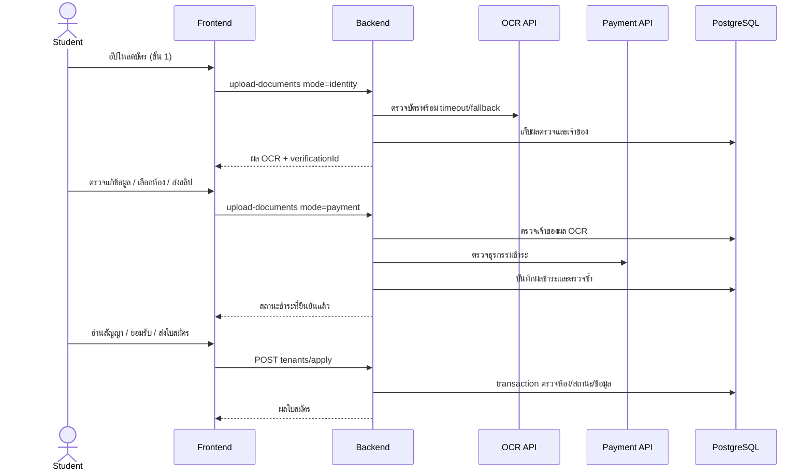
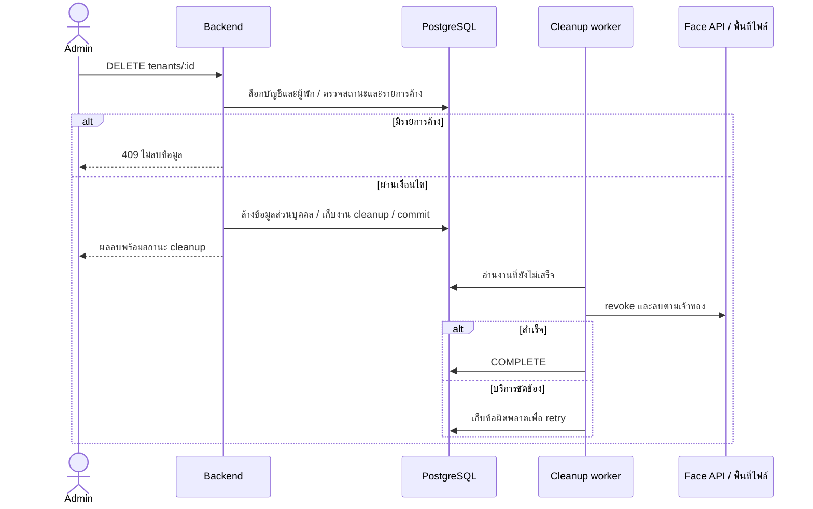

# 08. Sequence Diagrams

## สมัครเข้าพัก

```mermaid
sequenceDiagram
  actor S as Student
  participant F as Frontend
  participant B as Backend
  participant O as OCR API
  participant P as Payment API
  participant D as PostgreSQL
  S->>F: อัปโหลดบัตร (ขั้น 1)
  F->>B: upload-documents mode=identity
  B->>O: ตรวจบัตรพร้อม timeout/fallback
  B->>D: เก็บผลตรวจและเจ้าของ
  B-->>F: ผล OCR + verificationId
  S->>F: ตรวจแก้ข้อมูล / เลือกห้อง / ส่งสลิป
  F->>B: upload-documents mode=payment
  B->>D: ตรวจเจ้าของผล OCR
  B->>P: ตรวจธุรกรรมชำระ
  B->>D: บันทึกผลชำระและตรวจซ้ำ
  B-->>F: สถานะชำระที่ยืนยันแล้ว
  S->>F: อ่านสัญญา / ยอมรับ / ส่งใบสมัคร
  F->>B: POST tenants/apply
  B->>D: transaction ตรวจห้อง/สถานะ/ข้อมูล
  B-->>F: ผลใบสมัคร
```

## ลบข้อมูลผู้พัก

```mermaid
sequenceDiagram
  actor A as Admin
  participant B as Backend
  participant D as PostgreSQL
  participant W as Cleanup worker
  participant X as Face API / พื้นที่ไฟล์
  A->>B: DELETE tenants/:id
  B->>D: ล็อกบัญชีและผู้พัก / ตรวจสถานะและรายการค้าง
  alt มีรายการค้าง
    B-->>A: 409 ไม่ลบข้อมูล
  else ผ่านเงื่อนไข
    B->>D: ล้างข้อมูลส่วนบุคคล / เก็บงาน cleanup / commit
    B-->>A: ผลลบพร้อมสถานะ cleanup
    W->>D: อ่านงานที่ยังไม่เสร็จ
    W->>X: revoke และลบตามเจ้าของ
    alt สำเร็จ
      W->>D: COMPLETE
    else บริการขัดข้อง
      W->>D: เก็บข้อผิดพลาดเพื่อ retry
    end
  end
```

แผนภาพแสดงลำดับเชิงตรรกะจาก Service ไม่ใช่ผลทดสอบทุกสาขา อ่านผลที่ยืนยันแล้วใน [รายงาน QA](../qa/system-flow-report.md)
